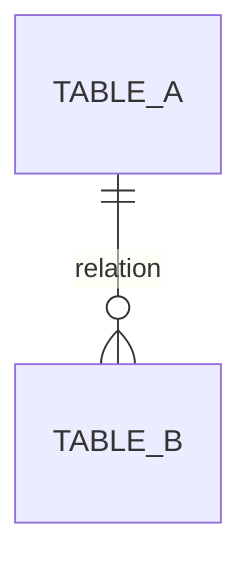

# 개발산출물생성

## 사용 목적

이 문서는 실제 프로젝트 산출물을 작성할 때 사용하는 실행용 템플릿이다.

개발리더 또는 산출물 작성자는 아래 항목을 프로젝트 상황에 맞게 채운 뒤, 필요한 산출물만 선택하여 작성한다.

이 문서는 다음과 같은 방식으로 사용할 수 있다.

1. 프로젝트 기본 정보를 입력한다.
2. 작성할 산출물을 선택한다.
3. repository, DB, 배포, 설정 파일 분석 결과를 입력한다.
4. 선택한 산출물별 템플릿에 내용을 채운다.
5. 고객에게 필요한 수준인지 검토한다.
6. 산출물별 개별 `.md` 파일로 분리하거나, 프로젝트 산출물 패키지로 제출한다.

---

# 1. 프로젝트 기본 정보 입력

아래 표를 프로젝트 기준으로 작성한다.

```md
## 문서 기본 정보

| 항목 | 내용 |
|---|---|
| 시스템명 |  |
| 프로젝트명 |  |
| 산출물명 |  |
| 작성 기준일 |  |
| 작성자 |  |
| 대상 Repository |  |
| 대상 Branch |  |
| 기준 Commit ID |  |
| 대상 환경 | DEV / STG / PRD |
| DBMS |  |
| 대상 Schema |  |
| DB 기준일 |  |
| 비고 |  |
```

작성 예시:

```md
## 문서 기본 정보

| 항목 | 내용 |
|---|---|
| 시스템명 | 주문관리시스템 |
| 프로젝트명 | 주문관리시스템 구축 프로젝트 |
| 산출물명 | Infra 아키텍처정의서 |
| 작성 기준일 | 2026-06-16 |
| 작성자 | 개발리더 |
| 대상 Repository | order-service, order-admin, order-batch |
| 대상 Branch | release/v1.0 |
| 기준 Commit ID | a13f9c2 |
| 대상 환경 | STG, PRD |
| DBMS | PostgreSQL |
| 대상 Schema | order |
| DB 기준일 | 2026-06-15 |
| 비고 | 테스트 단계 기준 |
```

---

# 2. 작성 대상 산출물 선택

프로젝트에서 필요한 산출물만 선택한다.

```md
## 작성 대상 산출물

| 산출물 | 작성 여부 | 작성 사유 | 비고 |
|---|---|---|---|
| Infra 아키텍처정의서 |  |  |  |
| Software 아키텍처정의서 |  |  |  |
| Data 아키텍처정의서 |  |  |  |
| DB Object 정의서 |  |  |  |
| Entity 정의서 |  |  |  |
| Table 정의서 |  |  |  |
| ERD |  |  |  |
| 프로그램 목록 |  |  |  |
| 인터페이스 설계서 |  |  |  |
| 배치 설계서 |  |  |  |
```

작성 예시:

```md
## 작성 대상 산출물

| 산출물 | 작성 여부 | 작성 사유 | 비고 |
|---|---|---|---|
| Infra 아키텍처정의서 | 작성 | 운영 이관 필요 |  |
| Software 아키텍처정의서 | 작성 | 유지보수 구조 설명 필요 |  |
| Data 아키텍처정의서 | 제외 | Table 정의서로 대체 가능 |  |
| DB Object 정의서 | 제외 | Procedure/Trigger 없음 |  |
| Entity 정의서 | 제외 | 고객 요청 없음 |  |
| Table 정의서 | 작성 | DB 설계 정보 제출 필요 |  |
| ERD | 작성 | 테이블 관계 설명 필요 | 별도 이미지 또는 Mermaid 작성 |
| 프로그램 목록 | 작성 | 개발 범위 정리 필요 |  |
| 인터페이스 설계서 | 작성 | 결제/배송 연계 존재 |  |
| 배치 설계서 | 작성 | 정기 배치 존재 |  |
```

---

# 3. Repository 분석 결과 입력

repository 분석 후 확인된 내용을 아래 양식에 입력한다.

```md
## Repository 분석 결과

| 구분 | 분석 결과 |
|---|---|
| Repository 목록 |  |
| 주요 애플리케이션 |  |
| 주요 기술스택 |  |
| Frontend 여부 |  |
| Backend 여부 |  |
| Admin 여부 |  |
| Batch 여부 |  |
| API 문서 존재 여부 |  |
| 주요 설정 파일 |  |
| 배포 관련 파일 |  |
| 외부 연계 설정 |  |
| 특이사항 |  |
```

### 3.1 애플리케이션 목록

```md
| Repository | 애플리케이션명 | 역할 | 기술스택 | 배포 단위 | 비고 |
|---|---|---|---|---|---|
|  |  |  |  |  |  |
```

### 3.2 주요 소스 구조

```md
| Repository | Directory/Package | 역할 | 비고 |
|---|---|---|---|
|  |  |  |  |
```

### 3.3 주요 설정 파일

```md
| 파일 | 위치 | 확인 내용 | 비고 |
|---|---|---|---|
| application.yml |  | DB, Redis, 외부 API, port |  |
| Dockerfile |  | 실행 방식, base image |  |
| build.gradle/pom.xml |  | 기술스택, dependency |  |
| Kubernetes manifest |  | deployment, service, ingress |  |
| CI/CD pipeline |  | build, deploy 절차 |  |
```

---

# 4. DB 분석 결과 입력

DB metadata, DDL, comment, constraint, index 정보를 기준으로 작성한다.

```md
## DB 분석 결과

| 구분 | 분석 결과 |
|---|---|
| DBMS |  |
| Schema |  |
| Table 수 |  |
| View 수 |  |
| Procedure/Function 수 |  |
| Trigger 수 |  |
| 주요 업무 영역 |  |
| 개인정보 포함 여부 |  |
| 암호화/마스킹 여부 |  |
| 특이사항 |  |
```

### 4.1 Table 목록

```md
| Table명 | 설명 | Schema | 관련 업무 | 사용 프로그램 | 비고 |
|---|---|---|---|---|---|
|  |  |  |  |  |  |
```

### 4.2 Column 정의

```md
| Table명 | 순번 | 컬럼명 | 설명 | Data Type | Length | PK | FK | Null | Default | 비고 |
|---|---:|---|---|---|---|---|---|---|---|---|
|  |  |  |  |  |  |  |  |  |  |  |
```

### 4.3 Key/Index 정보

```md
| 유형 | 이름 | Table | Column | Unique | 설명 |
|---|---|---|---|---|---|
| PK |  |  |  |  |  |
| FK |  |  |  |  |  |
| INDEX |  |  |  |  |  |
```

---

# 5. 산출물 생성 지시문

아래 지시문을 기준으로 선택한 산출물을 작성한다.

```md
다음 기준에 따라 개발 산출물을 작성한다.

1. 실제 repository, DB metadata, 설정 파일, 배포 정보를 기준으로 작성한다.
2. 고객이 이해해야 하는 핵심 구조와 운영 영향도 위주로 작성한다.
3. 소스코드의 모든 클래스, 메서드, 라인 단위 설명은 제외한다.
4. 선택한 산출물만 작성한다.
5. 각 산출물의 첫 부분에는 문서 기본 정보를 포함한다.
6. 자동 추출 가능한 정보와 수동 보완 정보가 혼재된 경우, 확인이 필요한 항목은 비고에 표시한다.
7. 설계서와 실제 구현이 다른 경우 실제 구현 기준으로 작성한다.
8. 업무 의미가 불명확한 항목은 임의 추정하지 말고 확인 필요로 표시한다.
9. 산출물 간 용어를 일관되게 맞춘다.
   - 프로그램명
   - Table명
   - API명
   - 배치명
   - 외부 시스템명
10. 최종 결과는 고객 제출 가능한 Markdown 형식으로 작성한다.
```

---

# 6. Infra 아키텍처정의서 템플릿

## 작성 목적

시스템이 어떤 인프라 환경에서 실행되고, 사용자가 어떤 경로로 접근하며, 서버와 네트워크, 배포 구조가 어떻게 구성되어 있는지를 정의한다.

## 확인 대상

| 확인 대상 | 확인 내용 |
|---|---|
| Kubernetes manifest | pod, service, ingress, configmap, secret, cronjob |
| Dockerfile | 애플리케이션 실행 방식 |
| application.yml/properties | 포트, DB, Redis, 외부 API 설정 |
| CI/CD pipeline | 빌드 및 배포 방식 |
| 인프라 구성도 | 서버, 네트워크, 보안 구간 |
| 방화벽/보안 그룹 | inbound/outbound, port, protocol |

## 작성 템플릿

```md
# Infra 아키텍처정의서

## 문서 기본 정보

| 항목 | 내용 |
|---|---|
| 시스템명 |  |
| 산출물명 | Infra 아키텍처정의서 |
| 작성 기준일 |  |
| 대상 Repository |  |
| 대상 Branch |  |
| 기준 Commit ID |  |
| 대상 환경 |  |
| DB 기준일 |  |

## 전체 인프라 구성

시스템의 전체 인프라 구성을 설명한다.

| 구성요소 | 역할 | 비고 |
|---|---|---|
|  |  |  |

## 환경별 구성

| 환경 | 용도 | 구성 | 비고 |
|---|---|---|---|
| DEV |  |  |  |
| STG |  |  |  |
| PRD |  |  |  |

## 서버/컨테이너 구성

| 서버/서비스명 | 역할 | 실행 방식 | 사양 또는 replica | 배포 대상 | 비고 |
|---|---|---|---|---|---|
|  |  |  |  |  |  |

## 주요 통신 경로

| 구분 | 출발지 | 목적지 | 프로토콜 | 포트 | 설명 |
|---|---|---|---|---|---|
|  |  |  |  |  |  |

## 배포 구성

| 애플리케이션 | 배포 단위 | 실행 방식 | 배포 도구 | 비고 |
|---|---|---|---|---|
|  |  |  |  |  |

## 보안 구성

| 보안 항목 | 적용 내용 | 비고 |
|---|---|---|
| HTTPS/TLS |  |  |
| 접근제어 |  |  |
| Secret 관리 |  |  |
| DB 접근제어 |  |  |

## 특이사항 및 제약사항

- 
```

## 작성 예시

```md
# Infra 아키텍처정의서

## 전체 인프라 구성

주문관리시스템은 Kubernetes 기반으로 구성되며, 사용자 요청은 External Load Balancer와 Ingress Controller를 통해 Backend API로 전달된다.

관리자 사용자는 Admin Web에 접속하며, Admin Web은 Backend API를 호출하여 주문, 결제, 배송 정보를 조회한다.

| 구성요소 | 역할 |
|---|---|
| External Load Balancer | 외부 사용자 요청 진입점 |
| Ingress Controller | URL 기반 라우팅 |
| order-service | 주문 API 처리 |
| order-admin | 관리자 화면 제공 |
| order-batch | 정기 배치 처리 |
| PostgreSQL | 주문, 결제, 배송 데이터 저장 |
| Redis | 주문 조회 캐시 저장 |
| Object Storage | 송장 파일 저장 |

## 환경별 구성

| 환경 | 용도 | 구성 |
|---|---|---|
| DEV | 개발자 테스트 | order-service 1식, PostgreSQL 1식 |
| STG | 통합 테스트 | order-service 2식, order-admin 1식, order-batch 1식 |
| PRD | 운영 | order-service 3식, order-admin 2식, order-batch 1식 |

## 주요 통신 경로

| 구분 | 출발지 | 목적지 | 프로토콜 | 포트 | 설명 |
|---|---|---|---|---|---|
| 사용자 요청 | User Browser | Load Balancer | HTTPS | 443 | 사용자 API 접근 |
| API 호출 | order-admin | order-service | HTTP | 8080 | 관리자 화면의 API 호출 |
| DB 접근 | order-service | PostgreSQL | TCP | 5432 | 주문 데이터 조회/저장 |
| Cache 접근 | order-service | Redis | TCP | 6379 | 주문 조회 캐시 |
| 외부 결제 연계 | order-service | Payment Gateway | HTTPS | 443 | 결제 승인 요청 |

## 배포 구성

order-service, order-admin, order-batch는 각각 Docker image로 빌드되며, GitLab CI를 통해 Kubernetes 환경에 배포된다.

| 애플리케이션 | 배포 단위 | 실행 방식 |
|---|---|---|
| order-service | Docker Image | Kubernetes Deployment |
| order-admin | Docker Image | Kubernetes Deployment |
| order-batch | Docker Image | Kubernetes CronJob |

## 보안 구성

- 외부 접근은 HTTPS만 허용한다.
- DB는 내부망에서만 접근 가능하다.
- DB 접속 정보는 Kubernetes Secret으로 관리한다.
- 관리자 화면은 사내망 또는 VPN 접속 사용자만 접근 가능하다.
```

---

# 7. Software 아키텍처정의서 템플릿

## 작성 목적

시스템을 구성하는 애플리케이션, 모듈, 기술스택, 소스 구조, 공통 기능 구조를 정의한다.

## 확인 대상

| 확인 대상 | 확인 내용 |
|---|---|
| repository 목록 | 애플리케이션 구성 |
| build.gradle, pom.xml, package.json | 기술스택, 라이브러리 |
| package/directory 구조 | 계층 구조 |
| Controller/Router | API 진입점 |
| Service | 업무 처리 구조 |
| Repository/Mapper/DAO | DB 접근 방식 |
| config package | 인증, 예외, 공통 설정 |

## 작성 템플릿

```md
# Software 아키텍처정의서

## 문서 기본 정보

| 항목 | 내용 |
|---|---|
| 시스템명 |  |
| 산출물명 | Software 아키텍처정의서 |
| 작성 기준일 |  |
| 대상 Repository |  |
| 대상 Branch |  |
| 기준 Commit ID |  |
| 대상 환경 |  |

## 애플리케이션 구성

| Repository | 애플리케이션명 | 역할 | 기술스택 | 비고 |
|---|---|---|---|---|
|  |  |  |  |  |

## 기술스택

| 구분 | 기술/버전 | 비고 |
|---|---|---|
| Language |  |  |
| Framework |  |  |
| DB Access |  |  |
| DB |  |  |
| Cache |  |  |
| Build Tool |  |  |
| Logging |  |  |
| Test |  |  |

## 소스 구조

| Repository | Package/Directory | 역할 |
|---|---|---|
|  |  |  |

## 주요 처리 흐름

1. 
2. 
3. 

## 공통 기능 구조

| 공통 기능 | 구현 위치 | 설명 |
|---|---|---|
| 인증/인가 |  |  |
| 공통 응답 |  |  |
| 예외 처리 |  |  |
| 로깅 |  |  |
| 외부 API 호출 |  |  |

## 특이사항 및 제약사항

- 
```

## 작성 예시

```md
# Software 아키텍처정의서

## 애플리케이션 구성

주문관리시스템은 사용자 주문 API, 관리자 화면, 배치 프로그램으로 구성된다.

| Repository | 애플리케이션명 | 역할 | 기술스택 |
|---|---|---|---|
| order-service | 주문 API 서버 | 주문 등록, 조회, 결제 연계 | Java 17, Spring Boot |
| order-admin | 관리자 Web | 주문 관리 화면 제공 | React, TypeScript |
| order-batch | 배치 서버 | 배송상태 동기화, 주문 마감 처리 | Java 17, Spring Batch |

## 기술스택

| 구분 | 기술 |
|---|---|
| Language | Java 17 |
| Framework | Spring Boot 3.x |
| ORM | Spring Data JPA |
| DB | PostgreSQL |
| Cache | Redis |
| Build Tool | Gradle |
| API 문서 | OpenAPI/Swagger |
| Logging | Logback |
| Test | JUnit5 |

## 소스 구조

| Package | 역할 |
|---|---|
| `com.example.order.api` | 주문 API Controller |
| `com.example.order.service` | 주문 업무 로직 |
| `com.example.order.domain` | 주문 Domain 및 Entity |
| `com.example.order.repository` | DB 접근 Repository |
| `com.example.order.client` | 외부 결제/배송 API Client |
| `com.example.order.config` | 인증, CORS, Swagger 설정 |
| `com.example.order.common` | 공통 응답, 예외, 유틸리티 |

## 주요 처리 흐름

주문 등록 요청은 다음 흐름으로 처리된다.

1. 사용자가 주문 등록 API를 호출한다.
2. OrderController가 요청값을 검증한다.
3. OrderService가 상품, 재고, 결제 가능 여부를 확인한다.
4. PaymentClient를 통해 외부 결제 승인 API를 호출한다.
5. 결제가 성공하면 OrderRepository를 통해 주문 정보를 저장한다.
6. 주문 결과를 공통 응답 포맷으로 반환한다.

## 공통 기능 구조

| 공통 기능 | 구현 위치 | 설명 |
|---|---|---|
| 인증/인가 | security config | JWT 기반 사용자 인증 |
| 공통 응답 | common.response | API 응답 포맷 표준화 |
| 예외 처리 | common.exception | 업무 예외 및 시스템 예외 처리 |
| 로깅 | logback.xml | API 요청/응답 및 오류 로그 기록 |
| 외부 API 호출 | client package | 결제, 배송 시스템 연계 |
```

---

# 8. Data 아키텍처정의서 템플릿

## 작성 목적

시스템에서 사용하는 데이터 저장소, DB 구성, 주요 데이터 흐름, 데이터 보안 구조를 정의한다.

## 작성 템플릿

```md
# Data 아키텍처정의서

## 문서 기본 정보

| 항목 | 내용 |
|---|---|
| 시스템명 |  |
| 산출물명 | Data 아키텍처정의서 |
| 작성 기준일 |  |
| 대상 Repository |  |
| 대상 Branch |  |
| 기준 Commit ID |  |
| DB 기준일 |  |

## 데이터 저장소 구성

| 저장소 | 유형 | 용도 | 주요 데이터 | 접근 애플리케이션 | 비고 |
|---|---|---|---|---|---|
|  |  |  |  |  |  |

## DB 및 Schema 구성

| 항목 | 내용 |
|---|---|
| DBMS |  |
| Schema |  |
| 주요 업무 영역 |  |
| 주요 Table |  |

## 주요 데이터 흐름

| 업무 흐름 | 생성/조회/변경 데이터 | 관련 프로그램 | 관련 Table | 비고 |
|---|---|---|---|---|
|  |  |  |  |  |

## 데이터 보안

| 항목 | 내용 | 비고 |
|---|---|---|
| 개인정보 포함 여부 |  |  |
| 암호화 대상 |  |  |
| 마스킹 대상 |  |  |
| 접근제어 |  |  |

## 데이터 보관 및 삭제

| 데이터 | 보관 기간 | 삭제/파기 기준 | 처리 프로그램 | 비고 |
|---|---|---|---|---|
|  |  |  |  |  |

## 특이사항 및 제약사항

- 
```

---

# 9. DB Object 정의서 템플릿

```md
# DB Object 정의서

## 문서 기본 정보

| 항목 | 내용 |
|---|---|
| 시스템명 |  |
| 산출물명 | DB Object 정의서 |
| 작성 기준일 |  |
| 대상 DBMS |  |
| 대상 Schema |  |
| DB 기준일 |  |

## DB Object 요약

| Object 유형 | 건수 | 설명 |
|---|---:|---|
| Table |  |  |
| View |  |  |
| Index |  |  |
| Sequence |  |  |
| Procedure |  |  |
| Function |  |  |
| Trigger |  |  |

## DB Object 목록

| Object 유형 | Object명 | Schema | 설명 | 사용 여부 | 관련 프로그램/업무 | 비고 |
|---|---|---|---|---|---|---|
|  |  |  |  |  |  |  |

## 주요 View 정의

| View명 | 목적 | 대상 Table | 사용 프로그램 | 비고 |
|---|---|---|---|---|
|  |  |  |  |  |

## 주요 Procedure/Function 정의

| 이름 | 유형 | 목적 | Parameter | 호출 프로그램 | 비고 |
|---|---|---|---|---|---|
|  |  |  |  |  |  |

## 주요 Trigger 정의

| Trigger명 | 대상 Table | 발생 시점 | 이벤트 | 처리 내용 | 비고 |
|---|---|---|---|---|---|
|  |  |  |  |  |  |

## 특이사항 및 제약사항

- 
```

---

# 10. Entity 정의서 템플릿

```md
# Entity 정의서

## 문서 기본 정보

| 항목 | 내용 |
|---|---|
| 시스템명 |  |
| 산출물명 | Entity 정의서 |
| 작성 기준일 |  |
| 대상 업무 영역 |  |
| 대상 Repository |  |
| 대상 Branch |  |
| 기준 Commit ID |  |
| DB 기준일 |  |

## Entity 목록

| Entity명 | 설명 | 관련 업무 | 대응 Table | 주요 식별자 | 비고 |
|---|---|---|---|---|---|
|  |  |  |  |  |  |

## Entity 상세 정의

| 항목 | 내용 |
|---|---|
| Entity명 |  |
| 설명 |  |
| 업무적 의미 |  |
| 주요 속성 |  |
| 식별자 |  |
| 대응 Table |  |
| 생성 조건 |  |
| 변경 조건 |  |
| 삭제 조건 |  |
| 주요 업무 규칙 |  |

## Entity 관계 정의

| 부모 Entity | 자식 Entity | 관계 유형 | 관계 설명 | Cardinality | 비고 |
|---|---|---|---|---|---|
|  |  |  |  |  |  |

## 특이사항 및 제약사항

- 
```

---

# 11. Table 정의서 템플릿

## 작성 목적

실제 DB에 생성되어 있는 물리 테이블과 컬럼, Key, Index, Constraint 정보를 정의한다.

## 확인 대상

| 확인 대상 | 확인 내용 |
|---|---|
| DB metadata | 테이블, 컬럼, 타입, 길이 |
| DDL | PK, FK, Index, Constraint |
| table comment | 테이블 설명 |
| column comment | 컬럼 설명 |
| repository/mapper | 사용 프로그램 |
| 암호화/마스킹 로직 | 개인정보 여부 |

## 작성 템플릿

```md
# Table 정의서

## 문서 기본 정보

| 항목 | 내용 |
|---|---|
| 시스템명 |  |
| 산출물명 | Table 정의서 |
| 작성 기준일 |  |
| 대상 DBMS |  |
| 대상 Schema |  |
| DB 기준일 |  |

## Table 목록

| Table명 | 설명 | Schema | 관련 업무 | 사용 프로그램 | 비고 |
|---|---|---|---|---|---|
|  |  |  |  |  |  |

## Table 상세 정의

| 항목 | 내용 |
|---|---|
| Table명 |  |
| 설명 |  |
| Schema |  |
| 주요 업무 |  |
| 데이터 생성 주체 |  |
| 데이터 변경 주체 |  |
| 보관 기간 |  |
| 개인정보 포함 여부 |  |
| 비고 |  |

## Column 정의

| 순번 | 컬럼명 | 설명 | Data Type | Length | PK | FK | Null | Default | 비고 |
|---:|---|---|---|---|---|---|---|---|---|
|  |  |  |  |  |  |  |  |  |  |

## Key 정의

| Key명 | 유형 | Table | Column | 참조 Table | 참조 Column | 설명 |
|---|---|---|---|---|---|---|
|  |  |  |  |  |  |  |

## Index 정의

| Index명 | Table | Column | Unique | 목적 | 비고 |
|---|---|---|---|---|---|
|  |  |  |  |  |  |

## Constraint 정의

| Constraint명 | 유형 | Table | Column | 조건 | 설명 |
|---|---|---|---|---|---|
|  |  |  |  |  |  |

## 특이사항 및 제약사항

- 
```

## 작성 예시

```md
# Table 정의서

## Table 목록

| Table명 | 설명 | Schema | 관련 업무 | 사용 프로그램 |
|---|---|---|---|---|
| TB_ORDER | 주문 기본 정보 | order | 주문 등록/조회 | OrderService |
| TB_ORDER_ITEM | 주문 상품 정보 | order | 주문 상품 관리 | OrderService |
| TB_PAYMENT | 결제 정보 | order | 결제 승인/취소 | PaymentService |
| TB_DELIVERY | 배송 정보 | order | 배송상태 관리 | DeliveryBatch |

## Table 상세 정의 - TB_ORDER

| 항목 | 내용 |
|---|---|
| Table명 | TB_ORDER |
| 설명 | 고객의 주문 기본 정보를 저장하는 테이블 |
| Schema | order |
| 주요 업무 | 주문 등록, 주문 조회, 주문 취소 |
| 데이터 생성 주체 | order-service |
| 데이터 변경 주체 | order-service, order-batch |
| 보관 기간 | 주문일 기준 5년 |
| 개인정보 포함 여부 | 포함 |

## Column 정의 - TB_ORDER

| 순번 | 컬럼명 | 설명 | Data Type | Length | PK | FK | Null | Default | 비고 |
|---|---|---|---|---|---|---|---|---|---|
| 1 | ORDER_ID | 주문 ID | VARCHAR | 30 | Y | N | N |  | 주문 식별자 |
| 2 | USER_ID | 사용자 ID | VARCHAR | 30 | N | N | N |  | 회원 식별자 |
| 3 | ORDER_STATUS | 주문 상태 | VARCHAR | 20 | N | N | N | CREATED | 공통코드 |
| 4 | TOTAL_AMOUNT | 총 주문 금액 | NUMERIC | 15,2 | N | N | N | 0 |  |
| 5 | ORDER_DT | 주문 일시 | TIMESTAMP |  | N | N | N | CURRENT_TIMESTAMP |  |
| 6 | CREATED_AT | 생성 일시 | TIMESTAMP |  | N | N | N | CURRENT_TIMESTAMP |  |
| 7 | UPDATED_AT | 수정 일시 | TIMESTAMP |  | N | N | Y |  |  |

## Key 정의

| Key명 | 유형 | Table | Column | 설명 |
|---|---|---|---|---|
| PK_TB_ORDER | PK | TB_ORDER | ORDER_ID | 주문 기본 정보 식별자 |

## Index 정의

| Index명 | Table | Column | Unique | 목적 |
|---|---|---|---|---|
| IDX_TB_ORDER_01 | TB_ORDER | USER_ID, ORDER_DT | N | 사용자별 주문내역 조회 성능 개선 |
| IDX_TB_ORDER_02 | TB_ORDER | ORDER_STATUS | N | 주문 상태별 조회 성능 개선 |
```

---

# 12. ERD 템플릿

````md
# ERD

## 문서 기본 정보

| 항목 | 내용 |
|---|---|
| 시스템명 |  |
| 산출물명 | ERD |
| 작성 기준일 |  |
| 대상 DBMS |  |
| 대상 Schema |  |
| DB 기준일 |  |

## ERD 작성 기준

| 기준 | 내용 |
|---|---|
| 물리 관계 | DB FK 기준 |
| 논리 관계 | SQL Join, ORM Relation, Service Logic 기준 |
| 업무 영역 | Table naming, package 구조, 업무 분류 기준 |
| 제외 대상 | 미사용 Table, 임시 Table 등 |

## 전체 ERD

ERD 이미지 또는 Mermaid ERD를 첨부한다.



## 업무 영역별 ERD

| 업무 영역 | 주요 Table | 설명 |
|---|---|---|
|  |  |  |

## 주요 관계 설명

| 기준 Table | 참조 Table | 관계 컬럼 | 관계 유형 | 관계 근거 | 비고 |
|---|---|---|---|---|---|
|  |  |  |  |  |  |

## 논리 관계 설명

| 기준 Table | 참조 Table | 관계 컬럼 | 관계 근거 | 사용 프로그램/SQL | 비고 |
|---|---|---|---|---|---|
|  |  |  |  |  |  |

## 특이사항 및 제약사항

- 
````

---

# 13. 프로그램 목록 템플릿

## 작성 목적

시스템을 구성하는 화면, API, Service, Module, Common 기능을 한눈에 파악할 수 있도록 목록으로 정리한다.

## 확인 대상

| 확인 대상 | 확인 내용 |
|---|---|
| Controller | API 프로그램 목록 |
| Frontend route | 화면 프로그램 목록 |
| Service class | 업무 서비스 목록 |
| Repository/Mapper | DB 사용 관계 |
| Security config | 권한 정보 |
| Swagger/OpenAPI | API 목록 보완 |

## 작성 템플릿

```md
# 프로그램 목록

## 문서 기본 정보

| 항목 | 내용 |
|---|---|
| 시스템명 |  |
| 산출물명 | 프로그램 목록 |
| 작성 기준일 |  |
| 대상 Repository |  |
| 대상 Branch |  |
| 기준 Commit ID |  |

## 프로그램 분류 기준

| 유형 | 설명 |
|---|---|
| 화면 | 사용자가 접근하는 Web 화면 |
| API | 외부 또는 화면에서 호출하는 REST API |
| Service | 업무 로직 처리 모듈 |
| Common | 공통 기능 모듈 |
| Batch | 정기 또는 조건 기반 실행 프로그램 |

## 전체 프로그램 목록

| 프로그램ID | 프로그램명 | 유형 | 업무영역 | 소스경로 | 주요 기능 | 사용 Table | 비고 |
|---|---|---|---|---|---|---|---|
|  |  |  |  |  |  |  |  |

## 화면 프로그램 목록

| 프로그램ID | 화면명 | URL/Route | 주요 기능 | 호출 API | 권한 | 비고 |
|---|---|---|---|---|---|---|
|  |  |  |  |  |  |  |

## API 프로그램 목록

| 프로그램ID | 프로그램명 | 유형 | Method | URL | Controller | Service | 사용 Table |
|---|---|---|---|---|---|---|---|
|  |  | API |  |  |  |  |  |

## Service 목록

| Service명 | 역할 | 주요 Method | 사용 Table | 호출 프로그램 | 비고 |
|---|---|---|---|---|---|
|  |  |  |  |  |  |

## 공통 모듈 목록

| 모듈명 | 소스경로 | 설명 | 사용 프로그램 | 비고 |
|---|---|---|---|---|
|  |  |  |  |  |

## 특이사항 및 제약사항

- 
```

## 작성 예시

```md
# 프로그램 목록

## 프로그램 분류 기준

| 유형 | 설명 |
|---|---|
| 화면 | 사용자가 접근하는 Web 화면 |
| API | 외부 또는 화면에서 호출하는 REST API |
| Service | 업무 로직 처리 모듈 |
| Common | 공통 기능 모듈 |
| Batch | 정기 또는 조건 기반 실행 프로그램 |

## API 프로그램 목록

| 프로그램ID | 프로그램명 | 유형 | Method | URL | Controller | Service | 사용 Table |
|---|---|---|---|---|---|---|---|
| API-ORD-001 | 주문 등록 | API | POST | /api/orders | OrderController | OrderService | TB_ORDER, TB_ORDER_ITEM |
| API-ORD-002 | 주문 상세 조회 | API | GET | /api/orders/{orderId} | OrderController | OrderQueryService | TB_ORDER, TB_ORDER_ITEM, TB_PAYMENT |
| API-ORD-003 | 주문 취소 | API | POST | /api/orders/{orderId}/cancel | OrderController | OrderCancelService | TB_ORDER, TB_PAYMENT |
| API-PAY-001 | 결제 승인 | API | POST | /api/payments/approve | PaymentController | PaymentService | TB_PAYMENT |

## 화면 프로그램 목록

| 프로그램ID | 화면명 | URL/Route | 주요 기능 | 호출 API |
|---|---|---|---|---|
| SCR-ORD-001 | 주문 목록 | /orders | 주문 목록 조회 | API-ORD-002 |
| SCR-ORD-002 | 주문 상세 | /orders/:orderId | 주문 상세 조회, 취소 | API-ORD-002, API-ORD-003 |
| SCR-PAY-001 | 결제 내역 | /payments | 결제 내역 조회 | API-PAY-001 |

## Service 목록

| Service명 | 역할 | 주요 Method | 사용 Table |
|---|---|---|---|
| OrderService | 주문 등록 처리 | createOrder | TB_ORDER, TB_ORDER_ITEM |
| OrderQueryService | 주문 조회 처리 | getOrder, searchOrders | TB_ORDER, TB_ORDER_ITEM |
| OrderCancelService | 주문 취소 처리 | cancelOrder | TB_ORDER, TB_PAYMENT |
| PaymentService | 결제 승인/취소 처리 | approve, cancel | TB_PAYMENT |
```

---

# 14. 인터페이스 설계서 템플릿

## 작성 목적

시스템과 외부 또는 내부 시스템 간 송수신되는 API, 메시지, 파일, 데이터 연계 구조를 정의한다.

## 확인 대상

| 확인 대상 | 확인 내용 |
|---|---|
| API client class | 외부 호출 API |
| application.yml/properties | endpoint, timeout, 인증 정보 |
| DTO | 요청/응답 전문 |
| service logic | 데이터 매핑 |
| retry config | 재시도 정책 |
| interface log table | 연계 이력 |

## 작성 템플릿

```md
# 인터페이스 설계서

## 문서 기본 정보

| 항목 | 내용 |
|---|---|
| 시스템명 |  |
| 산출물명 | 인터페이스 설계서 |
| 작성 기준일 |  |
| 대상 Repository |  |
| 대상 Branch |  |
| 기준 Commit ID |  |

## 인터페이스 목록

| 인터페이스ID | 인터페이스명 | 방향 | 방식 | 송신 시스템 | 수신 시스템 | 담당 프로그램 | 비고 |
|---|---|---|---|---|---|---|---|
|  |  | Inbound/Outbound | REST API/File/MQ |  |  |  |  |

## 인터페이스 상세

| 항목 | 내용 |
|---|---|
| 인터페이스ID |  |
| 인터페이스명 |  |
| 연계 목적 |  |
| 송신 시스템 |  |
| 수신 시스템 |  |
| 연계 방식 |  |
| Method |  |
| Endpoint |  |
| Protocol |  |
| 인증 방식 |  |
| Timeout |  |
| Retry |  |

## 요청 전문

| 항목명 | 타입 | 필수 | 설명 | 매핑 정보 | 비고 |
|---|---|---|---|---|---|
|  |  |  |  |  |  |

## 응답 전문

| 항목명 | 타입 | 필수 | 설명 | 매핑 정보 | 비고 |
|---|---|---|---|---|---|
|  |  |  |  |  |  |

## 데이터 매핑

| 외부 필드 | 내부 필드 | 내부 Table/Column | 변환 규칙 | 필수 여부 | 비고 |
|---|---|---|---|---|---|
|  |  |  |  |  |  |

## 오류 및 재처리

| 오류 상황 | 처리 방식 | 재처리 가능 여부 | 비고 |
|---|---|---|---|
|  |  |  |  |

## 특이사항 및 제약사항

- 
```

## 작성 예시

```md
# 인터페이스 설계서

## 인터페이스 목록

| 인터페이스ID | 인터페이스명 | 방향 | 방식 | 송신 시스템 | 수신 시스템 | 담당 프로그램 |
|---|---|---|---|---|---|---|
| IF-PAY-001 | 결제 승인 요청 | Outbound | REST API | 주문관리시스템 | 결제시스템 | PaymentClient |
| IF-PAY-002 | 결제 취소 요청 | Outbound | REST API | 주문관리시스템 | 결제시스템 | PaymentClient |
| IF-DLV-001 | 배송상태 조회 | Outbound | REST API | 주문관리시스템 | 배송시스템 | DeliveryClient |

## 인터페이스 상세 - IF-PAY-001

| 항목 | 내용 |
|---|---|
| 인터페이스ID | IF-PAY-001 |
| 인터페이스명 | 결제 승인 요청 |
| 연계 목적 | 주문 결제 승인 처리 |
| 송신 시스템 | 주문관리시스템 |
| 수신 시스템 | 결제시스템 |
| 연계 방식 | REST API |
| Method | POST |
| Endpoint | /external/payments/approve |
| Protocol | HTTPS |
| 인증 방식 | API Key Header |
| Timeout | 5초 |
| Retry | 3회 |

## 요청 전문

| 항목명 | 타입 | 필수 | 설명 | 매핑 정보 |
|---|---|---|---|---|
| orderId | String | Y | 주문 ID | TB_ORDER.ORDER_ID |
| paymentAmount | Number | Y | 결제 금액 | TB_ORDER.TOTAL_AMOUNT |
| paymentMethod | String | Y | 결제 수단 | 화면 입력값 |
| userId | String | Y | 사용자 ID | TB_ORDER.USER_ID |

## 응답 전문

| 항목명 | 타입 | 필수 | 설명 | 매핑 정보 |
|---|---|---|---|---|
| resultCode | String | Y | 처리 결과 코드 | 성공 여부 판단 |
| resultMessage | String | N | 처리 결과 메시지 | 오류 메시지 |
| paymentId | String | Y | 결제 ID | TB_PAYMENT.PAYMENT_ID |
| approvedAt | String | Y | 승인 일시 | TB_PAYMENT.APPROVED_AT |

## 오류 및 재처리

| 오류 상황 | 처리 방식 |
|---|---|
| Timeout | 최대 3회 재시도 |
| 4xx 응답 | 업무 오류로 처리하고 사용자에게 오류 메시지 반환 |
| 5xx 응답 | 시스템 오류로 처리하고 연계 실패 로그 저장 |
| 결제 승인 성공 후 DB 저장 실패 | 운영자 확인 후 수동 보정 |
```

---

# 15. 배치 설계서 템플릿

## 작성 목적

정해진 주기 또는 조건에 따라 실행되는 Batch, Scheduler, Job의 처리 구조와 운영 기준을 정의한다.

## 확인 대상

| 확인 대상 | 확인 내용 |
|---|---|
| batch package | Job, Step 구조 |
| scheduler config | 실행 주기 |
| SQL | 처리 대상 데이터 |
| batch log table | 실행 결과 |
| shell script | 실행 방식 |
| Kubernetes CronJob | 운영 실행 방식 |

## 작성 템플릿

```md
# 배치 설계서

## 문서 기본 정보

| 항목 | 내용 |
|---|---|
| 시스템명 |  |
| 산출물명 | 배치 설계서 |
| 작성 기준일 |  |
| 대상 Repository |  |
| 대상 Branch |  |
| 기준 Commit ID |  |

## 배치 목록

| 배치ID | 배치명 | 실행주기 | 실행방식 | 소스경로 | 사용 Table | 비고 |
|---|---|---|---|---|---|---|
|  |  |  |  |  |  |  |

## 배치 상세

| 항목 | 내용 |
|---|---|
| 배치ID |  |
| 배치명 |  |
| 목적 |  |
| 실행주기 |  |
| 실행방식 |  |
| 대상 데이터 |  |
| 사용 Table |  |
| 외부 연계 |  |
| 선행 조건 |  |
| 후행 처리 |  |

## 처리 흐름

1. 
2. 
3. 

## 사용 데이터

| 구분 | Table/File/API | 처리 내용 | 비고 |
|---|---|---|---|
| 조회 |  |  |  |
| 변경 |  |  |  |
| 생성 |  |  |  |

## 오류 및 재처리

| 오류 상황 | 처리 방식 | 재실행 가능 여부 | 비고 |
|---|---|---|---|
|  |  |  |  |

## 운영 확인 기준

| 항목 | 확인 방법 | 비고 |
|---|---|---|
| 실행 성공 여부 |  |  |
| 처리 건수 |  |  |
| 실패 건수 |  |  |
| 수동 재처리 |  |  |

## 특이사항 및 제약사항

- 
```

## 작성 예시

```md
# 배치 설계서

## 배치 목록

| 배치ID | 배치명 | 실행주기 | 실행방식 | 소스경로 | 사용 Table |
|---|---|---|---|---|---|
| BAT-DLV-001 | 배송상태 동기화 배치 | 매일 01:00 | Kubernetes CronJob | order-batch/delivery | TB_DELIVERY, TB_ORDER |
| BAT-ORD-001 | 미결제 주문 취소 배치 | 매 10분 | Scheduler | order-batch/order | TB_ORDER, TB_PAYMENT |
| BAT-ORD-002 | 주문 마감 배치 | 매일 23:50 | Spring Batch | order-batch/closing | TB_ORDER |

## 배치 상세 - BAT-DLV-001

| 항목 | 내용 |
|---|---|
| 배치ID | BAT-DLV-001 |
| 배치명 | 배송상태 동기화 배치 |
| 목적 | 배송시스템에서 배송상태를 조회하여 주문 배송상태를 갱신 |
| 실행주기 | 매일 01:00 |
| 실행방식 | Kubernetes CronJob |
| 대상 데이터 | 배송상태가 완료되지 않은 주문 |
| 사용 Table | TB_DELIVERY, TB_ORDER |
| 외부 연계 | 배송시스템 배송상태 조회 API |

## 처리 흐름

1. 배송상태가 완료되지 않은 주문 목록을 조회한다.
2. 배송시스템 API를 호출하여 최신 배송상태를 조회한다.
3. 응답받은 배송상태를 TB_DELIVERY에 반영한다.
4. 배송 완료 상태인 경우 TB_ORDER의 주문 상태를 배송 완료로 변경한다.
5. 처리 결과를 배치 로그에 기록한다.

## 오류 및 재처리

| 오류 상황 | 처리 방식 |
|---|---|
| 배송시스템 API Timeout | 3회 재시도 후 실패 처리 |
| 일부 주문 실패 | 실패 건만 로그에 기록하고 다음 건 처리 |
| DB 저장 실패 | 배치 실패 처리 후 운영자 확인 |
| 재실행 | 동일 주문의 현재 배송상태를 기준으로 재조회하므로 재실행 가능 |

## 운영 확인 기준

| 항목 | 확인 방법 |
|---|---|
| 실행 성공 여부 | 배치 실행 로그 확인 |
| 처리 건수 | 배치 결과 테이블 확인 |
| 실패 건수 | 배치 오류 로그 확인 |
| 수동 재처리 | 실패 주문 ID 기준으로 재실행 |
```

---

# 16. 산출물 작성 예시 프로젝트

아래 예시는 산출물 작성 방식을 이해하기 위한 가상의 프로젝트 기준이다.

| 항목 | 예시 |
|---|---|
| 시스템명 | 주문관리시스템 |
| Repository | `order-service`, `order-admin`, `order-batch` |
| 주요 기술 | Java 17, Spring Boot, JPA, PostgreSQL |
| 주요 기능 | 주문 등록, 주문 조회, 결제 연계, 배송상태 배치 |
| 작성 대상 산출물 | Infra 아키텍처정의서, SW 아키텍처정의서, Table 정의서, 프로그램 목록, 인터페이스 설계서, 배치 설계서 |

---

# 17. 최종 검수 체크리스트

산출물 작성 후 다음 항목을 확인한다.

```md
## 최종 검수 체크리스트

| 점검 항목 | 확인 여부 | 비고 |
|---|---|---|
| 산출물별 문서 기본 정보가 작성되었는가 |  |  |
| repository, branch, commit ID가 명시되었는가 |  |  |
| DB 기준일이 명시되었는가 |  |  |
| 고객 요청 범위에 맞는 산출물만 작성되었는가 |  |  |
| 고객이 이해해야 하는 핵심 내용 위주로 작성되었는가 |  |  |
| 소스코드 라인 단위의 과도한 설명은 제외되었는가 |  |  |
| 프로그램명, API명, Table명, 배치명 용어가 일관되는가 |  |  |
| 자동 추출 정보와 수동 보완 정보가 구분되었는가 |  |  |
| 확인이 필요한 항목은 비고에 표시되었는가 |  |  |
| 실제 repository와 DB 기준으로 작성되었는가 |  |  |
| 운영/장애/재처리 기준이 필요한 산출물에 포함되었는가 |  |  |
```

---

# 18. 산출물 작성 완료 후 권장 파일명

| 산출물 | 권장 파일명 |
|---|---|
| Infra 아키텍처정의서 | `아키텍처정의서_Infra.md` |
| Software 아키텍처정의서 | `아키텍처정의서_SW.md` |
| Data 아키텍처정의서 | `아키텍처정의서_Data.md` |
| DB Object 정의서 | `DB설계서_Object.md` |
| Entity 정의서 | `DB설계서_Entity.md` |
| Table 정의서 | `DB설계서_Table.md` |
| ERD | `DB설계서_ERD.md` |
| 프로그램 목록 | `프로그램설계서_목록.md` |
| 인터페이스 설계서 | `프로그램설계서_인터페이스.md` |
| 배치 설계서 | `프로그램설계서_배치.md` |

---

# 19. 개발리더 작성 메모

산출물 작성 시 다음 질문을 기준으로 내용을 판단한다.

> 이 산출물을 보는 고객이나 운영자가 무엇을 알아야 하는가?

| 산출물 영역 | 설명해야 할 핵심 |
|---|---|
| Infra | 운영 구조 |
| Software | 개발 구조 |
| Data/Table/ERD | 데이터 구조 |
| 프로그램 목록 | 기능 구조 |
| 인터페이스 | 연계 구조 |
| 배치 | 운영 처리 구조 |

최종 산출물은 고객이 시스템을 이해하고 운영 또는 유지보수에 활용할 수 있는 수준으로 작성한다.  
소스코드의 모든 클래스나 메서드를 나열하는 것이 아니라, 프로그램 구조, 데이터 구조, 연계 구조, 배치 처리, 운영 영향도를 중심으로 정리한다.
